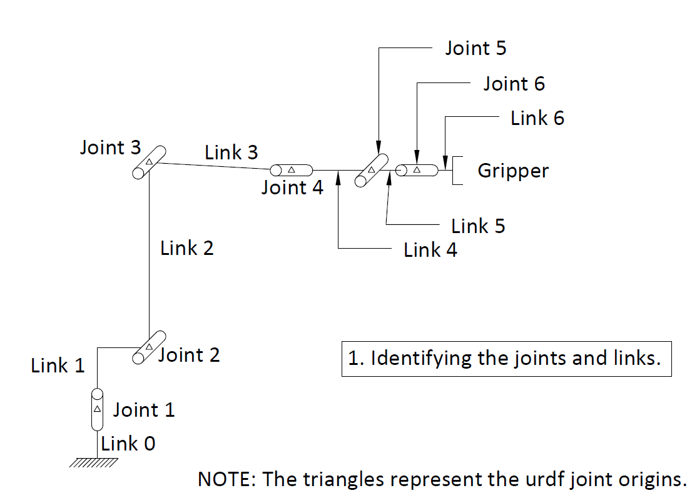
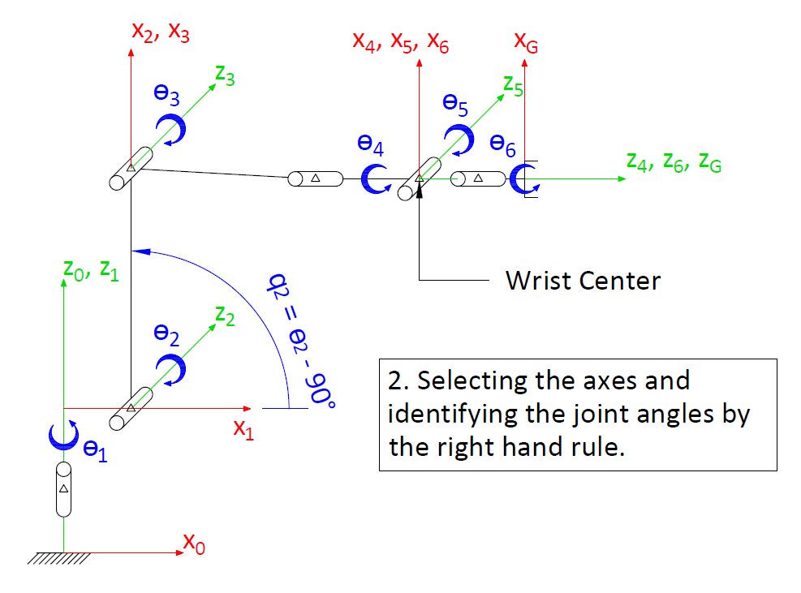
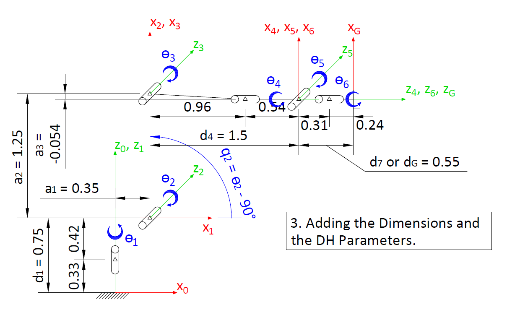
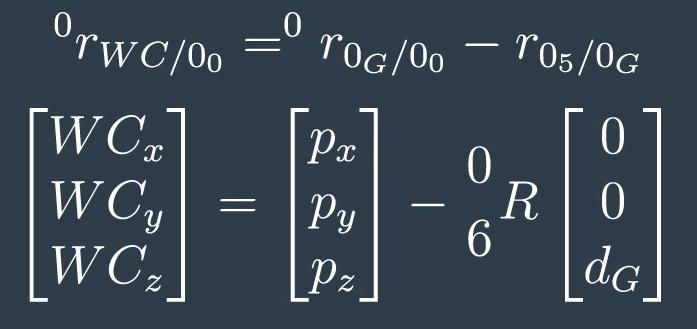
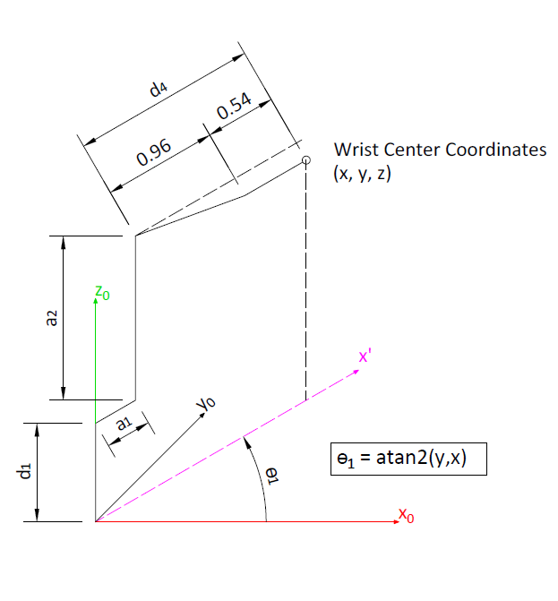
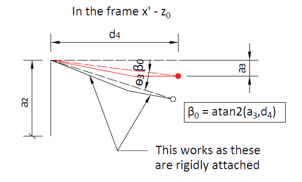
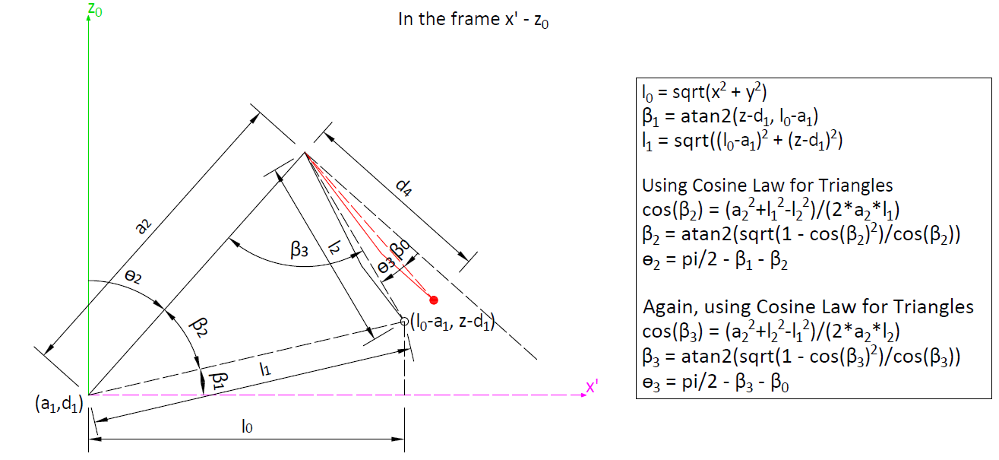
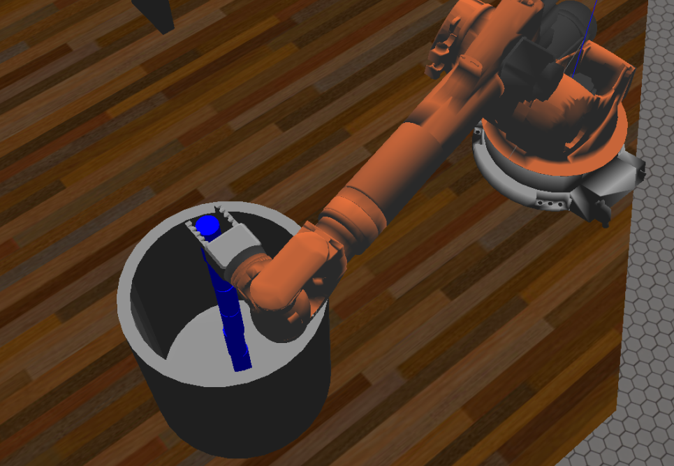

#RoboND Project Write-up: Pick and Place
This write-up contains supporting statements and figures for each [rubric](https://review.udacity.com/#!/rubrics/972/view) item that is used to assess the project.
## Criteria 1:
Run the forward_kinematics demo and evaluate the kr210.urdf.xacro file to perform kinematic analysis of Kuka KR210 robot and derive its DH parameters.
### Supporting Statements for Criteria 1:
1. First, the basic wire frame model of the robot made was made and the links and the joints were labelled. See image below:

2. The axes for the links were chosen and the joint angles were identified according to the Right Hand Rule as shown. These angles were tested to be in the (positive) sense as those in the robot model.

3. Based on the axes chosen above, the DH parameter table was prepared as shown below and was implemented in the diagram with the parameter values obtained from the urdf file:

|i|α<sub>i-1</sub>|a<sub>i-1</sub>|d<sub>i</sub>|ϴ<sub>i</sub>|
|:---:|:---:|:---:|:---:|:---:|
||Measured in a R.H. sense||Measured in a R.H. sense||
|1|α<sub>0</sub>= twist angle(Z<sub>0</sub>,Z<sub>1</sub>) about X<sub>0</sub>|a<sub>0</sub>= link len(Z<sub>0</sub>,Z<sub>1</sub>) about X<sub>0</sub>|d1= link offset(X<sub>0</sub>,X<sub>1</sub>) about Z<sub>1</sub>|ϴ<sub>1</sub>= joint angle(X<sub>0</sub>,X<sub>1</sub>) about Z<sub>1</sub>|
||α<sub>0</sub>= 0|a<sub>0</sub>= 0|d<sub>1</sub>= 0.75|ϴ<sub>1</sub>= ϴ<sub>1</sub>|
|2|α<sub>1</sub>= twist angle(Z<sub>1</sub>,Z<sub>2</sub>) about X<sub>1</sub>|a<sub>1</sub>= link len(Z<sub>1/</sub>,Z<sub>2</sub>) about X1|d<sub>2</sub>= link offset(X<sub>1</sub>,X<sub>2</sub>) about Z<sub>2</sub>|ϴ</sub>2</sub>= joint angle(X<sub>1</sub>,X<sub>2</sub>) about Z<sub>2</sub>|
||α<sub>1</sub>= -90|a<sub>1</sub>= 0.35|d<sub>2</sub>= 0|ϴ<sub>2</sub>= ϴ<sub>2</sub> - 90|			
|3|α<sub>2</sub>= twist angle(Z<sub>2</sub>,Z<sub>3</sub>) about X<sub>2</sub>|a<sub>2</sub>= link len(Z<sub>2</sub>,Z<sub>3</sub>) about X<sub>2</sub>|d<sub>3</sub>= link offset(X<sub>2</sub>,X<sub>3</sub>) about Z<sub>3</sub>|ϴ<sub>3</sub>= joint angle(X<sub>2</sub>,X<sub>3</sub>) about Z<sub>3</sub>|
||α<sub>2</sub>= 0|a<sub>2</sub>= 1.25|d<sub>3</sub>= 0|ϴ<sub>3</sub>= ϴ<sub>3</sub>|
|4|α<sub>3</sub>= twist angle(Z<sub>3</sub>,Z<sub>4</sub>) about X<sub>3</sub>|a<sub>3</sub>= link len(Z<sub>3</sub>,Z<sub>4</sub>) about X<sub>3</sub>|d<sub>4</sub>= link offset(X<sub>3</sub>,X<sub>4</sub>) about Z<sub>4</sub>|ϴ<sub>4</sub>= joint angle(X<sub>3</sub>,X<sub>4</sub>) about Z<sub>4</sub>|
||α<sub>3</sub>= -90|a<sub>3</sub>= -0.054|d<sub>4</sub>= 1.50|ϴ<sub>4</sub>= ϴ<sub>4</sub>|
|5|α<sub>4</sub>= twist angle(Z<sub>4</sub>,Z<sub>5</sub>) about X<sub>4</sub>|a<sub>4</sub>= link len(Z<sub>4</sub>,Z<sub>5</sub>) about X<sub>4</sub>|d<sub>5</sub>= link offset(X<sub>4</sub>,X<sub>5</sub>) about Z<sub>5</sub>|ϴ<sub>5</sub>= joint angle(X<sub>4</sub>,X<sub>5</sub>) about Z<sub>5</sub>|
||α<sub>4</sub>= 90|a<sub>4</sub>= 0|d<sub>5</sub>= 0|ϴ<sub>5</sub>= ϴ<sub>5</sub>|
|6|α<sub>5</sub>= twist angle(Z<sub>5</sub>,Z<sub>6</sub>) about X<sub>5</sub>|a<sub>5</sub>= link len(Z<sub>5</sub>,Z<sub>6</sub>) about X<sub>5</sub>|d<sub>6</sub>= link offset(X<sub>5</sub>,X<sub>6</sub>) about Z<sub>6</sub>|ϴ<sub>6</sub>= joint angle(X<sub>5</sub>,X<sub>6</sub>) about Z<sub>6</sub>|
||α<sub>5</sub>= -90|a<sub>5</sub>= 0|d<sub>6</sub>= 0|ϴ<sub>6</sub>= ϴ<sub>6</sub>|
|7|α<sub>6</sub>= twist angle(Z<sub>6</sub>,Z<sub>7</sub>) about X<sub>6</sub>|a<sub>6</sub>= link len(Z<sub>6</sub>,Z<sub>7</sub>) about X<sub>6</sub>|d<sub>7</sub>= link offset(X<sub>6</sub>,X<sub>7</sub>) about Z<sub>7</sub>|ϴ<sub>7</sub>= joint angle(X<sub>6</sub>,X<sub>7</sub>) about Z<sub>7</sub>|
||α<sub>6</sub>= 0|a<sub>6</sub>= 0|d<sub>7</sub>= 0.303|ϴ<sub>7</sub>= 0



## Criteria 2
Using the DH parameter table you derived earlier, create individual transformation matrices about each joint. In addition, also generate a generalized homogeneous transform between base_link and gripper_link using only end-effector(gripper) pose.
### Supporting Statements for Criteria 2:
#### 1. Working with SymPy, creating the individual homogeneous transforms:
```
alpha0, alpha1, alpha2, alpha3, alpha4, alpha5, alpha6 = symbols('alpha0:7')
a0, a1, a2, a3, a4, a5, a6 = symbols('a0:7')
d1, d2, d3, d4, d5, d6, d7 = symbols('d1:8')
q1, q2, q3, q4, q5, q6, q7 = symbols('q1:8')

#Dictionary for the DH parameters.
s = {    alpha0:     0,  a0:     0,  d1:  0.75,
         alpha1: -pi/2,  a1:  0.35,  d2:     0,  q2:q2-pi/2, 
         alpha2:     0,  a2:  1.25,  d3:     0,
         alpha3: -pi/2,  a3:-0.054,  d4:  1.50,
         alpha4:  pi/2,  a4:     0,  d5:     0,
         alpha5: -pi/2,  a5:     0,  d6:     0,
         alpha6:     0,  a6:     0,  d7: 0.303,  q7:0}


T0_1 = Matrix([[             cos(q1),            -sin(q1),            0,              a0],
               [ sin(q1)*cos(alpha0), cos(q1)*cos(alpha0), -sin(alpha0), -sin(alpha0)*d1],
               [ sin(q1)*sin(alpha0), cos(q1)*sin(alpha0),  cos(alpha0),  cos(alpha0)*d1],
               [                   0,                   0,            0,               1]])
T0_1 = T0_1.subs(s)

T1_2 = Matrix([[             cos(q2),            -sin(q2),            0,              a1],
               [ sin(q2)*cos(alpha1), cos(q2)*cos(alpha1), -sin(alpha1), -sin(alpha1)*d2],
               [ sin(q2)*sin(alpha1), cos(q2)*sin(alpha1),  cos(alpha1),  cos(alpha1)*d2],
               [                   0,                   0,            0,               1]])
T1_2 = T1_2.subs(s)

T2_3 = Matrix([[             cos(q3),            -sin(q3),            0,              a2],
               [ sin(q3)*cos(alpha2), cos(q3)*cos(alpha2), -sin(alpha2), -sin(alpha2)*d3],
               [ sin(q3)*sin(alpha2), cos(q3)*sin(alpha2),  cos(alpha2),  cos(alpha2)*d3],
               [                   0,                   0,            0,               1]])
T2_3 = T2_3.subs(s)

T3_4 = Matrix([[             cos(q4),            -sin(q4),            0,              a3],
               [ sin(q4)*cos(alpha3), cos(q4)*cos(alpha3), -sin(alpha3), -sin(alpha3)*d4],
               [ sin(q4)*sin(alpha3), cos(q4)*sin(alpha3),  cos(alpha3),  cos(alpha3)*d4],
               [                   0,                   0,            0,               1]])
T3_4 = T3_4.subs(s)

T4_5 = Matrix([[             cos(q5),            -sin(q5),            0,              a4],
               [ sin(q5)*cos(alpha4), cos(q5)*cos(alpha4), -sin(alpha4), -sin(alpha4)*d5],
               [ sin(q5)*sin(alpha4), cos(q5)*sin(alpha4),  cos(alpha4),  cos(alpha4)*d5],
               [                   0,                   0,            0,               1]])
T4_5 = T4_5.subs(s)

T5_6 = Matrix([[             cos(q6),            -sin(q6),            0,              a5],
               [ sin(q6)*cos(alpha5), cos(q6)*cos(alpha5), -sin(alpha5), -sin(alpha5)*d6],
               [ sin(q6)*sin(alpha5), cos(q6)*sin(alpha5),  cos(alpha5),  cos(alpha5)*d6],
               [                   0,                   0,            0,               1]])
T5_6 = T5_6.subs(s)

T6_G = Matrix([[             cos(q7),            -sin(q7),            0,              a6],
               [ sin(q7)*cos(alpha6), cos(q7)*cos(alpha6), -sin(alpha6), -sin(alpha6)*d7],
               [ sin(q7)*sin(alpha6), cos(q7)*sin(alpha6),  cos(alpha6),  cos(alpha6)*d7],
               [                   0,                   0,            0,               1]])
T6_G = T6_G.subs(s)
```
#### 2. Creating the homogeneous transform between base_link and gripper_link:
```
T0_2 = simplify(T0_1 * T1_2) 
T0_3 = simplify(T0_2 * T2_3)
T0_4 = simplify(T0_3 * T3_4)
T0_5 = simplify(T0_4 * T4_5)
T0_6 = simplify(T0_5 * T5_6)
T0_G = simplify(T0_6 * T6_G)
```
Here, the T0_G is the homogeneous transform between base_link and gripper_link.
## Criteria 3
Decouple Inverse Kinematics problem into Inverse Position Kinematics and Inverse Orientation Kinematics; doing so derive the equations to calculate all individual joint angles.
### Supporting Statements for Criteria 3:
#### 1. Locating the Wrist Center
To decouple the inverse kinematics problem, first we need to find the position of the wrist center. This can be done using:

where px,py and pz are the end effector coordinates in the base frame, <sup>0</sup><sub>6</sub>R is the rotational transform from base 0 to frame 6 or frame 6 is expressed in terms of base 6 and d<sub>G</sub> is from the DH parameters which is the horizontal distance between the wrist center and the end effector.
<sup>0</sup><sub>6</sub>R = <sup>0</sup><sub>5</sub>R as there is no rotational component between frame 5 and 6.
<sup>0</sup><sub>6</sub>R can be calculated from the end effector yaw (rotation about the z axis), pitch (rotation about the y axis) and roll (rotation about the x axis) that is known and then a correction is applied to the rotation matrix obtained from the yaw, pitch and roll as this gives us the end effector frame in the robot model in terms of the base frame but the end effector frame used in the robot model is not the same x-y-z alignment as the DH model.

#### 2. Decoupling the Inverse Kinematics Problem into Inverse Position Kinematics
Here, we need to solve for getting the first three angles from the Wrist Center Position as the first three angles control the position.
The equations have been derived along with the diagrams shown:




#### 3. Decoupling the Inverse Kinematics Problem into Inverse Orientation Kinematics
Here, we need to solve for the next and last three angles by finding the Euler angles from the rotation matrix that describes the frame 6 in terms of 3 or <sup>3</sup><sub>6</sub>R.
This can be calculated once we have the first three angles as if `Rrpy` is the rotation matrix from the end effector roll-pitch-yaw and `R_corr` rotates the gripper frame in DH parameters to gripper frame in robot model:
```
R0_6 = Rrpy * R_corr.inv()
R0_3 * R3_6 = Rrpy * R_corr.inv()
#Multiplying both sides with the inverse of R0_3
R3_6 = R0_3.inv() * Rrpy * R_corr.inv()
```
Then the symbolic `R3_6` comes out to be:
```
[-sin(q4)*sin(q6) + cos(q4)*cos(q5)*cos(q6), -sin(q4)*cos(q6) - sin(q6)*cos(q4)*cos(q5), -sin(q5)*cos(q4)],
[                           sin(q5)*cos(q6),                           -sin(q5)*sin(q6),          cos(q5)],
[-sin(q4)*cos(q5)*cos(q6) - sin(q6)*cos(q4),  sin(q4)*sin(q6)*cos(q5) - cos(q4)*cos(q6),  sin(q4)*sin(q5)]])
```
The last three angles can be calculated from it using:
```
q4 = atan2(R3_6[2,2],-R3_6[0,2])
q5 = atan2(sqrt(R3_6[0,2]**2 + R3_6[2,2]**2), R3_6[1,2])
q6 = atan2(-R3_6[1,1],R3_6[1,0])
```
## Criteria 4
Fill in the IK_server.py file with properly commented python code for calculating Inverse Kinematics based on previously performed Kinematic Analysis. Your code must guide the robot to successfully complete 8/10 pick and place cycles. 
### Supporting Statements for Criteria 4:
`IK_server.py` contains properly commented code. The robot tracks the planned trajectory and successfully completes the pick and place operation. In my tests, each pick and place was perfomed successfully using the **Next** button.
Here is a bonus picture of a sweet object stack I made:
